### Steps for creating f5 VSI in IBM Cloud using Schematics workspace

  > Note: Before proceeding with steps below, ensure that the f5 qcow2 image is copied into IBM Cloud Object Storage(COS) bucket in cloud.ibm.com.  

1.	Login to https://cloud.ibm.com  
2.	Create a VPC. Navigate to https://cloud.ibm.com/vpc-ext/  

    Ensure you are in VPC Gen 2. Generation number is found at the top left corner of the screen.   

    Under **Network** – **VPCs**. Click **New virtual private cloud**.   

    Enter a name. Here, the name is **vpc-test** and select the appropriate resource group. Here the resource group name is **VNF VPC Development**.    

    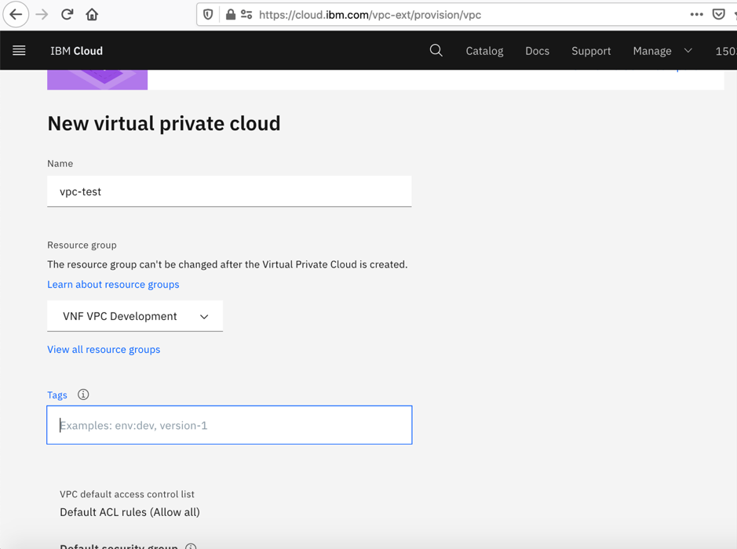  
    
    Enter a name for subnet. Here, the name is **vpc-test-subnet**. Select a resource group for subnet. Here the resource group name is **VNF VPC Development**.    

    Select the location as **Dallas 1**. Click **Create virtual private cloud** at the right side of the screen.        

    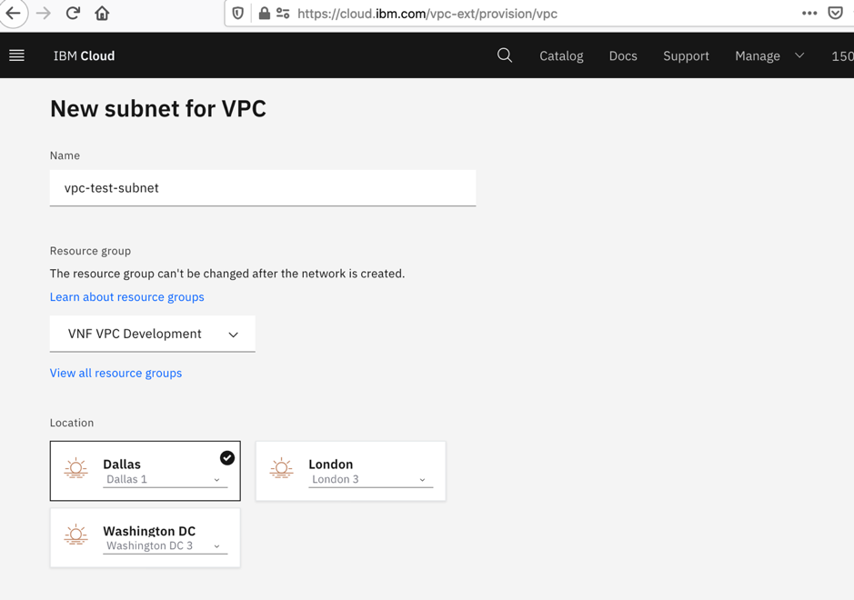  
     
    Ensure that the vpc and subnet are created successfully and status is **Available**. Note the subnet **ID** of the created subnet as shown below:  
    
    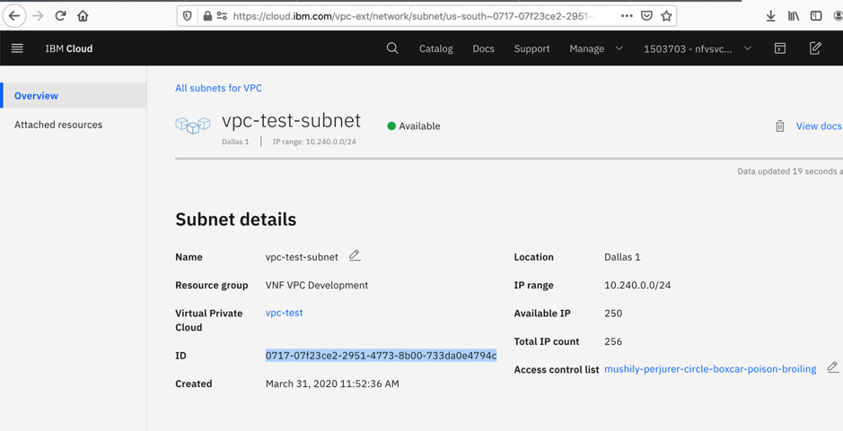  
    
 3.	Create an I am API key for the account where COS bucket resides.   
    
    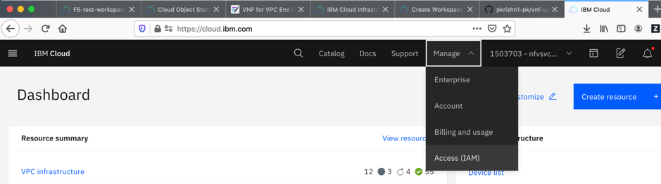   
    
    Click on **Manage** - **Access (IAM)**.   

    Click on **API Keys**. Click on **Create an IBM Cloud API key**.   
    
     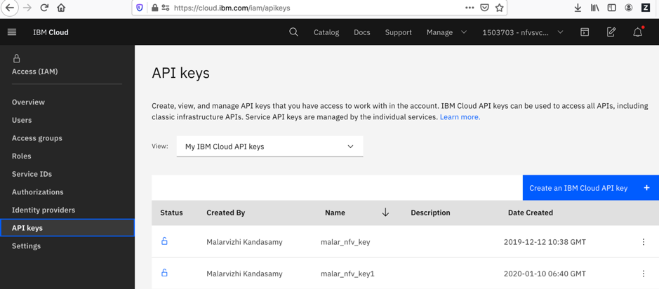  
    
    Enter a name for api key like cos-api-key. Click **Create**. Copy the API Key.   
    
    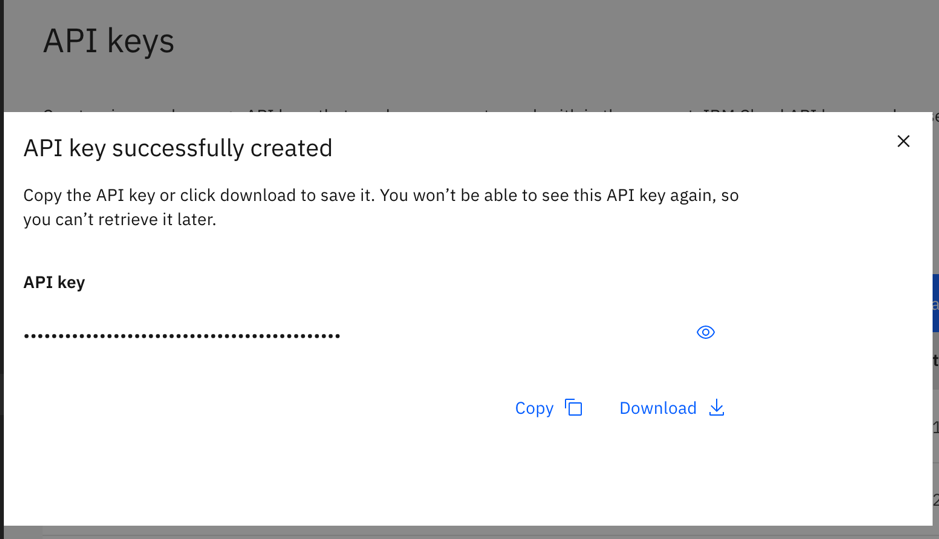  
    
 4. Note the image url and instance id of COS file object:  

    Go to **Dashboard**, under **Storage**, click on the Cloud Object Storage name. It will list all the buckets of the COS.   

    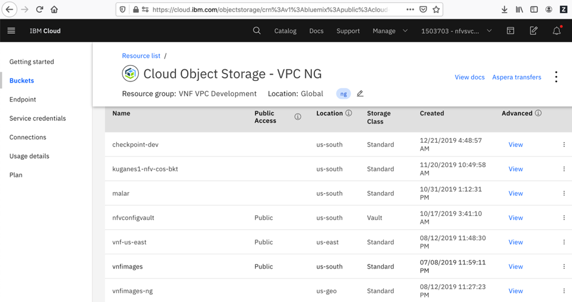  
    
    Click on the COS bucket. Click on the object actions menu in the listed qcow2 file object.   
    
    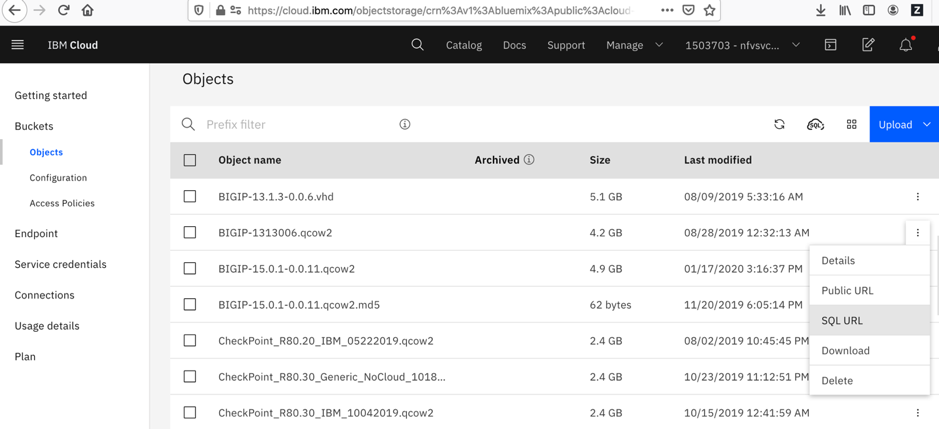  
    
    Click on the **SQL URL**. Copy the URL. 
    
    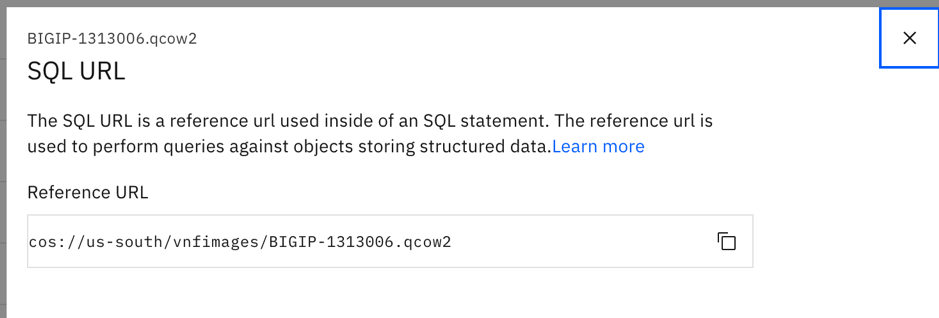    
    
    Click on **Service credentials** from the left side section found under **Endpoint**.   
    
    Copy the instance id from **resource_instance_id** key from the json below. The id is the text between **:** and **::** at the end. See selected text above.
    
    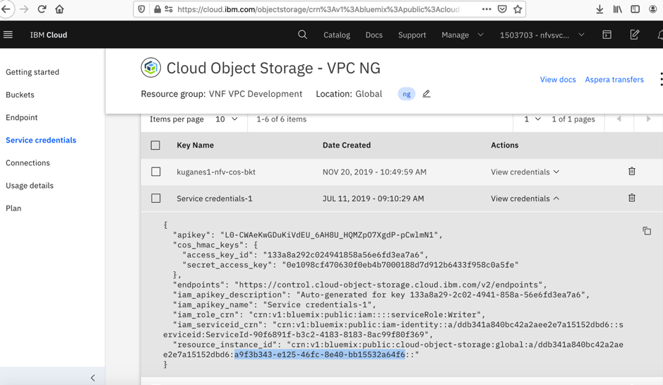   
    
5.	Add SSH key in IBM Cloud VPC by following steps from this link:     
    https://cloud.ibm.com/docs/vpc-on-classic-vsi?topic=vpc-on-classic-vsi-ssh-keys
 
6.	Go to **Catalog** and search for **Schematics**.  

    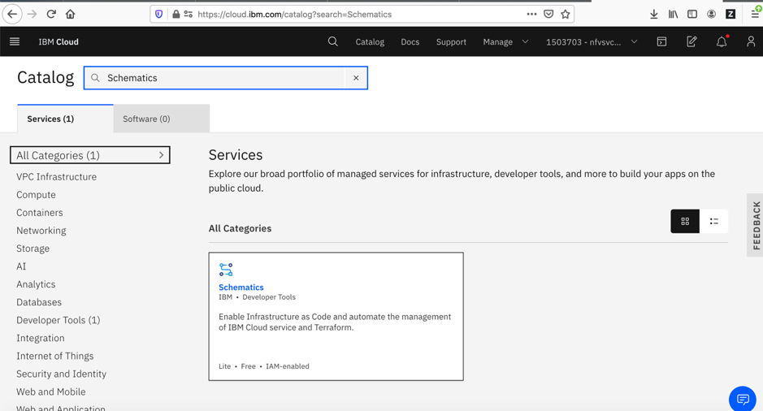  
    
7.	Click on **Schematics** and create a workspace using **Create Workspace**.   

    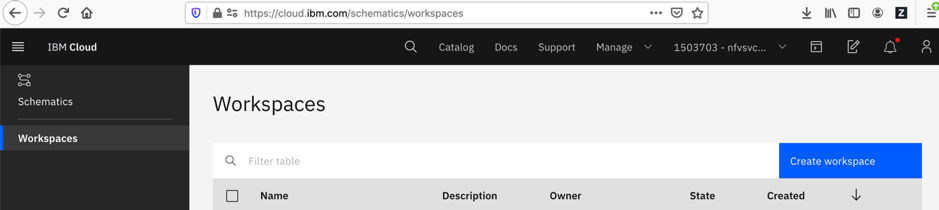  
    
    Enter a name for workspace **f5-workspace** and select a resource group. Here the resource group name is **VNF VPC Development**.     

     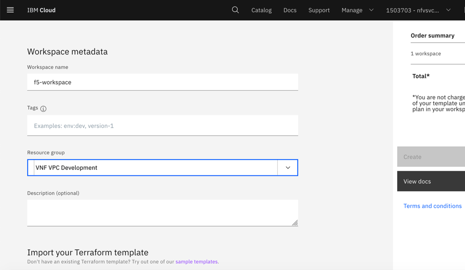   
     
    Under **Import your Terraform template**, enter the url as **https://github.com/pkrishn1-pk/vnf-vpc-f5**   

    Click **Retrieve input variables**.    

    The input variables are fetched from terraform template.    

    Following are the variables required for creating a f5 VSI:   
    
    | **Names** | **Value** | **Description** |  
    | --- | ------- | ------- |    
    | ibmcloud_svc_api_key | S1xxxxxxxxxxxxxxxxxxx | Value of the COS API Key created. Refer step 3. |   
    | resource_group | VNF VPC Development | Resource group of the f5 VSI. |      
    | vnf_cos_instance_id | a9xxxxxxxxxx-exx-4xxx-8xxx-bbxxxxxxxxf6 | resource_instance_id of service credentials in COS bucket. Refer step 4.|    
    | vnf_cos_image_url | cos://us-south/vnfimages/BIGIP-15.0.1-0.0.11.qcow2 | SQL URL of qcow2 object file. Refer step 4. |  
    | vpc_name | vpc-test | Name of VPC instance. Refer step 2 |     
    | subnet_id | 0717-07f23ce2-2951-4773-8b00-733da0e4794c | Id of subnet used by VPC. Refer step 2. |   
    | ssh_key_name | test-ssh-key | ssh key name. Refer step 5. |    
    | vnf_instance_name | f5-test | Name of the F5 VSI which is to be created.  |   
    | ibmcloud_endpoint | cloud.ibm.com | url of cloud or test cloud.  Accepted values are cloud.ibm.com, test.cloud.ibm.com |  
    
    Click **Create** in the right side of the screen.    

    Click **Apply plan**.    
    
    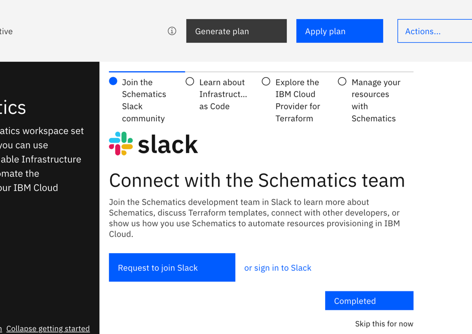      
    
    Wait for few minutes till the plan is applied and status is **Completed** as shown below:   
    
    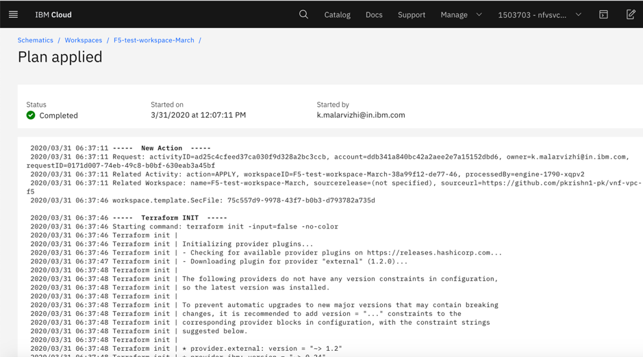       
    
    Now, navigate to **VPC Gen 2** and look for the f5 VSI. It should be in status **Powered On**.    
    
    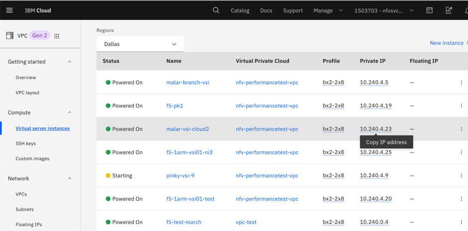    
    
    

 
  
     
     

    
    

